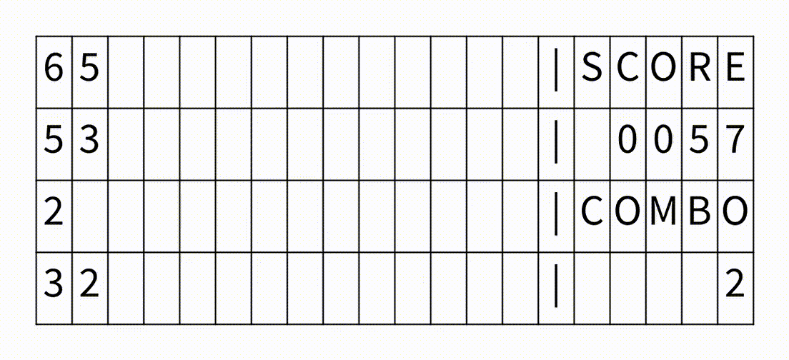

# NumberCombo

## Overview

Number Combo is a puzzle game where you control and stack numbers flowing from the right, combining identical numbers to create larger numbers.

## DEMO

## Game Rules

Numbers flow from right to left and are controlled using the arrow keys to stack them. When two identical numbers are next to each other, they combine to form a single number that is one higher. The flowing numbers are randomly chosen between 1 and the current maximum number on the board minus one (if the maximum number is 1, then 1 is chosen). When a number greater than 4 appears on the board, the number of flowing numbers increases from one to two. The two flowing numbers can be rotated. When a number greater than 7 appears on the board, the speed of the flowing numbers increases. The game ends when a number occupies the spawning position of the flowing numbers, preventing new numbers from appearing.
The game has two difficulty levels: EASY and HARD. In HARD mode, the speed of the flowing numbers is faster.

## Controls

Describe how to play the game:

- Arrow Keys: Move the player up, down, left, or right.
- R Key: Reset the game.
- U Key: Undo the last move.

## Installation and Usage

Download [Processing 4.3](https://processing.org/download/) and run this sketch folder in Processing 4.3.

## Notes

## Author
* Keisuke Morita

## License

This project is licensed under the MIT License - see the [LICENSE.md](./LICENSE.md) file for details.
